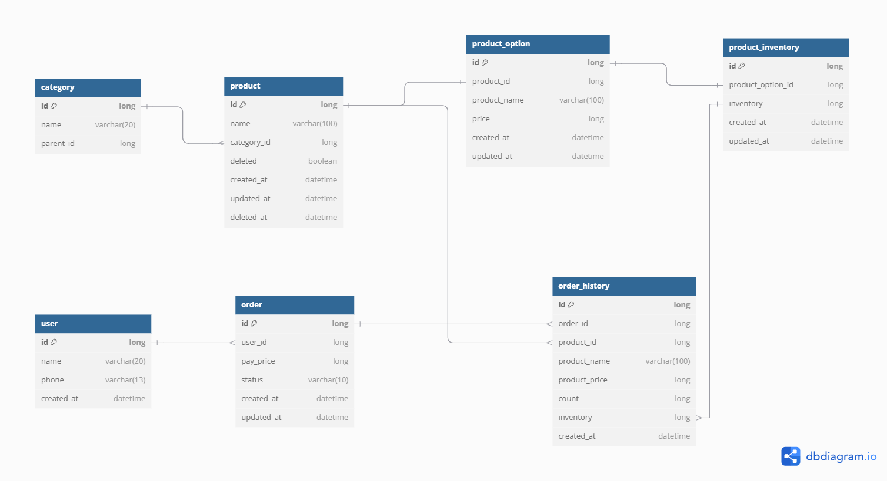

## ● 프로젝트 설명
> ## Skills  <br/>
> - Java, Spring Boot, JUnit, JPA, H2 Embedded

>상품 조회와 상품 주문 API 를 사용할 수 있는 프로젝트 입니다.   
레이어드 아키텍처 + DIP 를 준수하여 프로젝트를 작성하였습니다.   

- interfaces : Controller, Request/Response dto
- application : facade
- domain : Model, business Logic, IRepository
- infra : RepositoryImpl, Entity
- support : exception 관리

<br/>
DIP를 준수하기 위해 Entity <-> Domain 변환 로직은 <br/>
Entity 클래스 내부에 작성하였으며, <br/>
application 과 infra 단에서 도메인 dto 를 바라보게 하였습니다.
<br/>
<br/>
주문 시 동시성 처리는 하나의 자원을 사용하기에 공정성이 중요하다고 판단, <br/>
비관적 락을 사용하였으며 해당 로직에 대해 통합테스트를 작성하였습니다. <br/>

<br/>
주문 시 상태를 따로 관리합니다. (OrderType) <br/>

<br/>
아래는 ERD 입니다



## ● 프로젝트 빌드 및 실행 방법
방법은 IntelliJ 기준으로 작성하였습니다.<br/>
<br/>
1. 상단 메뉴 중 Build > Build Project 클릭
2. 성공적으로 끝난다면 좌측 하단에 메세지 출력
3. 프로젝트 목록에서 HomeworkApplication 를 우클릭 후 Run HomeworkApplication 클릭
4. DB 는 /h2-console 에서 확인 가능합니다.
ex ) http://localhost:8080/h2-console/

## ● API Spec

**1. 상품 조회 API**
----
## Request
* **URL**

| 메서드 | 요청 URL                  |
|:---:|:------------------------|
| GET | /api/v1/search/products |

## Response
```json
{
    "code": "200",
    "data": {
        "products": [
            {
                "id": 768848,
                "name": "[STANLEY] GO CERAMIVAC 진공 텀블러/보틀 3종",
                "categoryId": 35,
                "productOption": {
                    "id": 1,
                    "productId": 768848,
                    "price": 21000,
                    "inventory": 27
                },
                "createdAt": "2024-10-13T20:57:48.39529"
            },
            {
                "id": 748943,
                "name": "디오디너리 데일리 세트 (Daily set)",
                "categoryId": 21,
                "productOption": {
                    "id": 2,
                    "productId": 748943,
                    "price": 19000,
                    "inventory": 80
                },
                "createdAt": "2024-10-13T20:57:48.39529"
            },
            ...
        ]
    },
    "success": true
}
```

**2. 상품 주문 API**
----
## Request
* **URL**

| 메서드  | 요청 URL               |
|:----:|:--------------|
| POST | /api/v1/order/orderItems |


* **Request Element**

| 파라미터       | 타입   | 필수여부 | 설명      |
|:-----------|:-----|:----:|:--------|
| userId     | Long |  O   | 유저 ID   |
| orderItems | List |  O   | 주문할 상품들 |

* **orderItems**

| 파라미터      | 타입     | 필수여부 | 설명    |
|:----------|:-------|:----:|:------|
| productId | Long   |  O   | 상품 ID |
| count     | Long |  O   | 구매 수량 |

## Response
```json
{
    "code": "200",
    "data": {
        "order": {
            "id": 238,
            "userId": 1,
            "orderHistories": [
                {
                    "id": 78,
                    "orderId": 238,
                    "productId": 768848,
                    "productName": "[STANLEY] GO CERAMIVAC 진공 텀블러/보틀 3종",
                    "productPrice": 21000,
                    "count": 1,
                    "inventory": 27,
                    "createdAt": "2024-10-14T21:23:11.3496056"
                },
                {
                    "id": 79,
                    "orderId": 238,
                    "productId": 748943,
                    "productName": "디오디너리 데일리 세트 (Daily set)",
                    "productPrice": 19000,
                    "count": 1,
                    "inventory": 80,
                    "createdAt": "2024-10-14T21:23:11.3496056"
                }
            ],
            "payPrice": 42500,
            "status": "COMPLETED",
            "createdAt": "2024-10-14T21:23:11.3496056",
            "updatedAt": "2024-10-14T21:23:11.3496056"
        }
    },
    "success": true
}
```