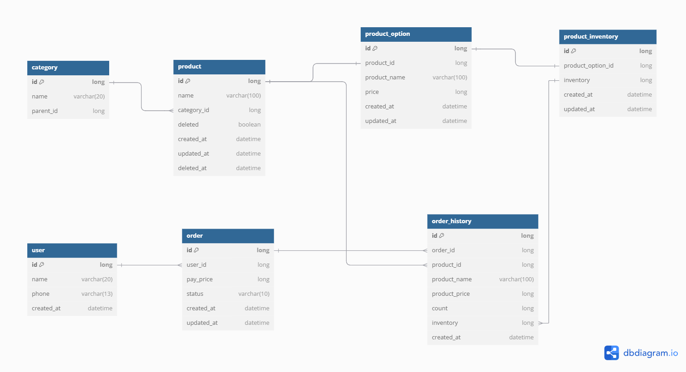

# 🛒 E-Commerce Toy Project

> **클린 아키텍처와 동시성 제어를 적용한 이커머스 주문 서비스**  
> DIP를 준수한 레이어드 아키텍처와 비관적 락(Pessimistic Lock) 기반 재고 동시성 처리

<br>

## 📌 목차
- [프로젝트 개요](#-프로젝트-개요)
- [기술 스택](#-기술-스택)
- [핵심 기술적 도전과 해결 방법](#-핵심-기술적-도전과-해결-방법)
- [시스템 아키텍처](#-시스템-아키텍처)
- [ERD](#-erd)
- [API 명세](#-api-명세)
- [실행 방법](#-실행-방법)

<br>

## 🎯 프로젝트 개요

상품 조회와 상품 주문 기능을 제공하는 이커머스 백엔드 서비스입니다.  
단순한 CRUD 구현을 넘어, **의존성 역전 원칙(DIP)** 기반의 레이어 설계와  
**다중 사용자의 동시 주문 시 발생하는 재고 정합성 문제**를 직접 설계하고 해결하는 데 집중했습니다.

| 항목 | 내용 |
|------|------|
| 개발 인원 | 1인 |
| 주요 목표 | 클린 아키텍처, DIP 준수, 동시성 제어 (비관적 락) |

<br>

## 🛠 기술 스택

| 분류 | 기술 |
|------|------|
| Language | Java 17 |
| Framework | Spring Boot 3.3, Spring Data JPA, Spring AOP |
| Database | H2 (Embedded) |
| ORM | Hibernate 6, JPA |
| 빌드 | Gradle |
| 테스트 | JUnit5, Mockito |

<br>

## 💡 핵심 기술적 도전과 해결 방법

### 1. 비관적 락(Pessimistic Lock)으로 재고 동시성 제어

**문제**: 여러 사용자가 동시에 같은 상품을 주문할 경우, 재고가 음수로 떨어지거나 Lost Update가 발생할 수 있음

**해결**:
- 주문 처리 시 `@Lock(LockModeType.PESSIMISTIC_WRITE)` 를 통해 상품 조회 시점에 **배타 락** 획득
- 하나의 자원(재고)에 대해 **공정성이 중요**하다고 판단하여, 낙관적 락이 아닌 비관적 락 선택
- 트랜잭션이 끝날 때까지 다른 요청은 해당 행을 수정 불가 → **데이터 정합성 보장**

```java
// ProductJpaRepository.java
@Lock(LockModeType.PESSIMISTIC_WRITE)
@Query("select p from ProductEntity p where p.id = :productId")
Optional<ProductEntity> findByIdWithLock(@Param("productId") long productId);
```

```
[동시 주문 처리 흐름]
주문 요청 A ──► findByIdWithLock (락 획득) ──► 재고 감소 ──► 커밋 (락 해제)
주문 요청 B ──► findByIdWithLock (락 대기) ──────────────────────► 재고 감소 ──► 커밋
```

---

### 2. DIP 기반 레이어드 아키텍처 설계

**문제**: 비즈니스 로직이 특정 DB 기술(JPA, H2 등)에 의존하면 기술 교체 시 대규모 수정 필요

**해결**:
- **Repository 인터페이스를 domain 레이어에 정의**, 구현체(JPA)는 infra 레이어에 위치
- domain은 infra를 절대 참조하지 않으며, infra가 domain을 바라보는 단방향 의존성 유지
- Entity ↔ Domain 변환 로직은 **Entity 클래스 내부에 캡슐화**하여 도메인 오염 방지

```
[의존성 방향]
interfaces → application → domain ← infra
                                ↑
                       (Repository interface 위치)
```

---

### 3. Facade 패턴으로 트랜잭션 경계 명확화

**문제**: 주문 처리는 여러 도메인 서비스(상품, 주문, 재고)를 조합해야 하며, 하나라도 실패 시 전체 롤백 필요

**해결**:
- `OrderFacade`에서 `@Transactional`로 하나의 트랜잭션 범위 설정
- 상품 재고 확인 → 재고 감소 → 주문 생성 → 주문내역 생성 → 총액 계산의 흐름을 Facade에서 오케스트레이션
- 각 도메인 서비스는 단일 책임만 가지며, 조합 로직은 Facade에 집중

```
OrderFacade.order()
  ├── productService.getProductWithLock()   // 비관적 락으로 상품 조회
  ├── product.checkCount()                  // 재고 확인 (도메인 로직)
  ├── productService.decreaseInventory()    // 재고 감소
  ├── orderService.saveOrderHistory()       // 주문내역 저장
  ├── order.priceCalculate()               // 총액 계산 (도메인 로직)
  └── order.orderCompleted()               // 주문 완료 처리 (도메인 로직)
```

---

### 4. Fetch Join으로 N+1 문제 해결

**문제**: 상품 목록 조회 시 상품마다 ProductOption을 별도 쿼리로 조회하는 N+1 문제 발생

**해결**:
- `@Query`에 `join fetch p.productOption` 적용으로 **단일 쿼리로 상품 + 옵션 정보 함께 조회**
- `deleted = false` 조건으로 소프트 딜리트(Soft Delete) 지원

```java
@Query("select p from ProductEntity p join fetch p.productOption " +
       "where p.deleted = false ")
List<ProductEntity> findAllWithOptions();
```

<br>

## 🏗 시스템 아키텍처

```
┌─────────────────────────────────────────────┐
│                   Client                    │
└──────────────────┬──────────────────────────┘
                   │ HTTP
┌──────────────────▼──────────────────────────┐
│          Spring Boot Application            │
│                                             │
│  interfaces/api  ← Controller, DTO         │
│       ↓                                     │
│  application     ← Facade (유스케이스 조합)  │
│       ↓                                     │
│  domain          ← Service, Model, IRepo   │
│       ↑                                     │
│  infra           ← JPA Entity, RepoImpl    │
│                                             │
│  support         ← 예외처리, 공통 설정       │
└──────────────────┬──────────────────────────┘
                   │
         ┌─────────▼─────────┐
         │   H2 Database     │
         │  (Embedded / 개발) │
         └───────────────────┘
```

**레이어 역할 요약**

| 레이어 | 역할 |
|--------|------|
| `interfaces` | Controller, Request/Response DTO — 외부 요청 수신 및 응답 |
| `application` | Facade — 여러 도메인 서비스를 조합하여 유스케이스 구현 |
| `domain` | Service, Model, Repository 인터페이스 — 핵심 비즈니스 로직 |
| `infra` | JPA Entity, Repository 구현체 — 영속성 기술 세부 구현 |
| `support` | 공통 예외처리 (`@ControllerAdvice`), 커스텀 예외 클래스 |

<br>

## 📊 ERD



<br>

## 📡 API 명세

| 기능 | Method | URL |
|------|--------|-----|
| 상품 전체 조회 | GET | `/api/v1/search/products` |
| 상품 주문 | POST | `/api/v1/order/orderItems` |

<details>
<summary><b>상품 전체 조회</b></summary>

**GET** `/api/v1/search/products`

```json
// Response
{
  "code": "200",
  "data": {
    "products": [
      {
        "id": 768848,
        "name": "[STANLEY] GO CERAMIVAC 진공 텀블러/보틀 3종",
        "categoryId": 35,
        "productOption": {
          "id": 1,
          "productId": 768848,
          "price": 21000,
          "inventory": 27
        },
        "createdAt": "2024-10-13T20:57:48.39529"
      }
    ]
  },
  "success": true
}
```
</details>

<details>
<summary><b>상품 주문</b></summary>

**POST** `/api/v1/order/orderItems`

```json
// Request
{
  "userId": 1,
  "orderItems": [
    { "productId": 768848, "count": 1 },
    { "productId": 748943, "count": 2 }
  ]
}

// Response
{
  "code": "200",
  "data": {
    "order": {
      "id": 238,
      "userId": 1,
      "orderHistories": [
        {
          "id": 78,
          "orderId": 238,
          "productId": 768848,
          "productName": "[STANLEY] GO CERAMIVAC 진공 텀블러/보틀 3종",
          "productPrice": 21000,
          "count": 1,
          "inventory": 26,
          "createdAt": "2024-10-14T21:23:11.3496056"
        }
      ],
      "payPrice": 21000,
      "status": "COMPLETED",
      "createdAt": "2024-10-14T21:23:11.3496056",
      "updatedAt": "2024-10-14T21:23:11.3496056"
    }
  },
  "success": true
}
```

> 재고 부족 시 `OutOfStockException` 발생 → 주문 전체 롤백
</details>

<br>

## ⚙️ 실행 방법

**IntelliJ 기준**

1. 상단 메뉴 **Build > Build Project** 클릭
2. 프로젝트 목록에서 `HomeworkApplication` 우클릭 후 **Run HomeworkApplication** 클릭
3. 아래 주소로 접근

| 서비스 | URL |
|--------|-----|
| H2 콘솔 | http://localhost:8080/h2-console |
| 상품 조회 API | http://localhost:8080/api/v1/search/products |

> H2 콘솔 접속 정보: JDBC URL `jdbc:h2:./data`, Username `sa`, Password 없음
